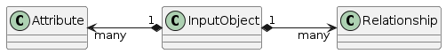
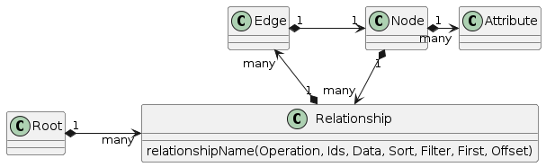

import Tabs from '@theme/Tabs';
import TabItem from '@theme/TabItem';


This page is a description on the CRUD data models (create, read, update, and delete) in the backend of Nexus Graph.

GraphQL
-------

[GraphQL] is a language specification published by Facebook for constructing graph APIs. Nexus Graph is backed by an
GraphQL API to manage all the graph data.

API Structure
-------------

GraphQL in Nexus Graph splits its schema into 2 kinds of objects:

1. Query objects which are used to compose queries and mutations
2. Input Objects which are used to supply input data to mutations

The schema for both kind of objects are derived from the entity relationship among Nodes and Links (defined by the
[JPA data model]). Both contain a set of attributes and relationships. Attributes are properties of the entity.
Relationships are links to other entities in the graph.

### Input Objects

Input objects just contain attributes and relationship with names directly matching the property names in the JPA
annotated model:



### Query Objects

Query Objects are more complex than Input Objects since they do more than simply describe data; they must support
filtering, sorting, and pagination. Nexus Graph GraphQL structure for queries and mutations is depicted below:



GraphQL schema for Nexus Graph defines a root document which represents the root of the object graph. There are 4
entities that are marked as directly navigable from the root of this graph:

1. Graph
2. Node
3. Link
4. Note

Nexus Graph's GraphQL root document consist of _relationships_ to those a single rootable entity: Graph. All other
non-rootable entities (Node, Link, and Note) must be referenced through traversal of the relationships in the entity
relationship graph.

Nexus Graph model relationships follows [Relay's Connection pattern].  Relationships are a collection of graph edges.
Each edge contains a graph node. The node is an instance of a data model which in turn contains its own attributes and
set of relationships.

Making Calls
------------

### Creating a New Graph

<Tabs>
  <TabItem value="request" label="Request" default>
    ```graphql
    mutation {
        graph(op: UPSERT, data: {name: "My Graph"}) {
            edges {
                node {
                    id
                    links(op: UPSERT, data: [{onCanvasId: "HDdH3f3", fields: "{\"type\": \"my link\"}"}]) {
                        edges {
                            node {
                                id
                                source(op: UPSERT, data: {
                                    onCanvasId: "kjGUgyf",
                                    fields: "{\"name\": \"source node\", \"description\": \"my source node\", \"labels\": \"[\\\"label1\\\", \\\"[label2]\\\"]\"}",
                                    note: {noteId: "JHG&d2c"}
                                }) {
                                    edges {
                                        node {
                                            ...nodeAttributes
                                        }
                                    }
                                }
                                target(op: UPSERT, data: {
                                    onCanvasId: "IuJeIf3",
                                    fields: "{\"name\": \"target node\", \"description\": \"my target node\", \"labels\": \"[\\\"label1\\\", \\\"[label2]\\\"]\"}",
                                    note: {noteId: "i87UGfd"}
                                }) {
                                    edges {
                                        node {
                                            ...nodeAttributes
                                        }
                                    }
                                }
                            }
                        }
                    }
                }
            }
        }
    }

    fragment nodeAttributes on Node {
        id
        fields
        onCanvasId
        note {
            edges {
                node {
                    noteId
                }
            }
        }
    }
    ```
  </TabItem>
  <TabItem value="response" label="Response">
    ```json
    {
        "data":{
            "graph":{
                "edges":[
                    {
                        "node":{
                            "id":"1",
                            "links":{
                                "edges":[
                                    {
                                        "node":{
                                            "id":"1",
                                            "source":{
                                                "edges":[
                                                    {
                                                        "node":{
                                                            "id":"1",
                                                            "fields":"{\"name\": \"source node\", \"description\": \"my source node\", \"labels\": \"[\\\"label1\\\", \\\"[label2]\\\"]\"}",
                                                            "onCanvasId":"kjGUgyf",
                                                            "note":{
                                                                "edges":[
                                                                    {
                                                                        "node":{
                                                                            "noteId":"JHG&d2c"
                                                                        }
                                                                    }
                                                                ]
                                                            }
                                                        }
                                                    }
                                                ]
                                            },
                                            "target":{
                                                "edges":[
                                                    {
                                                        "node":{
                                                            "id":"2",
                                                            "fields":"{\"name\": \"target node\", \"description\": \"my target node\", \"labels\": \"[\\\"label1\\\", \\\"[label2]\\\"]\"}",
                                                            "onCanvasId":"IuJeIf3",
                                                            "note":{
                                                                "edges":[
                                                                    {
                                                                        "node":{
                                                                            "noteId":"i87UGfd"
                                                                        }
                                                                    }
                                                                ]
                                                            }
                                                        }
                                                    }
                                                ]
                                            }
                                        }
                                    }
                                ]
                            }
                        }
                    }
                ]
            }
        }
    }
    ```
  </TabItem>
</Tabs>

[GraphQL]: https://graphql.org/
[JPA data model]: https://download.oracle.com/otn-pub/jcp/persistence-2_1-fr-eval-spec/JavaPersistence.pdf?AuthParam=1719199826_ee6dd88167d33fe7e52533421c072552
[Relay's Connection pattern]: http://graphql.org/learn/pagination/
