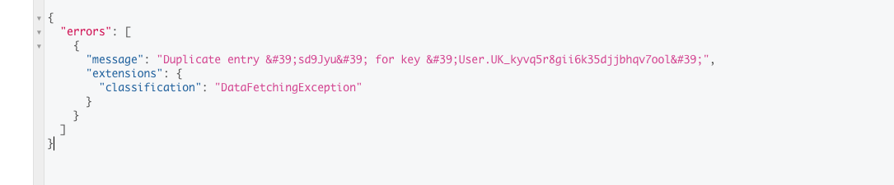

import Tabs from '@theme/Tabs';
import TabItem from '@theme/TabItem';


This page is a description on the knowledge graph CRUD data models (create, read, update, and delete) in the backend of
Nexus Graph.

GraphQL
-------

[GraphQL] is a language specification published by Facebook for constructing graph APIs. Nexus Graph is backed by an
GraphQL API to manage all the graph data.

API Structure
-------------

GraphQL in Nexus Graph splits its schema into 2 kinds of objects:

1. Query objects which are used to compose queries and mutations
2. Input Objects which are used to supply input data to mutations

The schema for both kind of objects are derived from the entity relationship among Nodes and Links (defined by the
[JPA data model]). Both contain a set of attributes and relationships. Attributes are properties of the entity.
Relationships are links to other entities in the graph.

### Input Objects

Input objects just contain attributes and relationship with names directly matching the property names in the JPA
annotated model:


### Query Objects

Query Objects are more complex than Input Objects since they do more than simply describe data; they must support
filtering, sorting, and pagination. Nexus Graph GraphQL structure for queries and mutations is depicted below:


GraphQL schema for Nexus Graph defines a root document which represents the root of the object graph. There are 4
entities that are marked as directly navigable from the root of this graph:

1. Graph
2. Node
3. Link
4. Note

Nexus Graph's GraphQL root document consist of _relationships_ to those a single rootable entity: Graph. All other
non-rootable entities (Node, Link, and Note) must be referenced through traversal of the relationships in the entity
relationship graph.

Nexus Graph model relationships follows [Relay's Connection pattern].  Relationships are a collection of graph edges.
Each edge contains a graph node. The node is an instance of a data model which in turn contains its own attributes and
set of relationships.

Graph API
---------

#### Preliminary Concerns

GraphQL specification provides great flexibility in API expression; one of them is _being able to create a set of
related, composite objects (a subgraph) and connect it to an existing, persisted graph_. This is the foundation on which
Nexus Graph is able to __persist arbitrarily complex knowledge graph in one API request__. Here is how we achieve it:

In GraphQL, any property in the schema can take arguments. Relationships in our data model have a standard set of
arguments that either constrain the edges fetched from a relationship or supply data to a mutation:

1. The `ids` parameter is a collection of node identifiers. It is used to select one or more nodes from a relationship.
2. The filter parameter is used to build [RSQL](https://github.com/jirutka/rsql-parser) filter predicates that select
   zero or more nodes from a relationship.
3. The sort parameter is used to order a relationship’s edges by one or more node attributes.
4. The parameters after and first are used to paginate a relationship across multiple API requests.
5. The `op` argument describes the operation to perform on the relationship. When not provided, this argument defaults
   to a FETCH operation which simply reads the collection of edges.
6. The data parameter is provided for operations that mutate the collection (UPSERT, UPDATE, and REPLACE), It contains a
   list of input objects that match the data type of the relationship. _Each data object can be a complex subgraph which
   contains other objects through nested relationships_.

Entity attributes generally do not take arguments.

The subgraph automatically attach itself to the parent object. For example, in the following query, two newly created
nodes automatically binds themselves to a directed link between them which binds link itself to the owning graph; the
graph once being created immediately attaches to a first-time user, _all
in one API call_:

<Tabs>
  <TabItem value="request" label="Mutation" default>
    ```graphql
    mutation {
       user(op: UPSERT, data: {id: 1, oidcId: "sd9Jyud"}) {
          edges {
             node {
                id
                oidcId
                graphs(op: UPSERT, data: {name: "My Graph"}) {
                   edges {
                      node {
                         id
                         links(op: UPSERT, data: [{onCanvasId: "HDdH3f3", fields: "{\"type\": \"my link\"}"}]) {
                            edges {
                               node {
                                  id
                                  source(op: UPSERT, data: {
                                     onCanvasId: "kjGUgyf",
                                     fields: "{\"name\": \"source node\", \"description\": \"my source node\", \"labels\": \"[\\\"label1\\\", \\\"[label2]\\\"]\"}",
                                     note: {noteId: "JHG&d2c"}
                                  }) {
                                     edges {
                                        node {
                                           ...nodeAttributes
                                        }
                                     }
                                  }
                                  target(op: UPSERT, data: {
                                     onCanvasId: "IuJeIf3",
                                     fields: "{\"name\": \"target node\", \"description\": \"my target node\", \"labels\": \"[\\\"label1\\\", \\\"[label2]\\\"]\"}",
                                     note: {noteId: "i87UGfd"}
                                  }) {
                                     edges {
                                        node {
                                           ...nodeAttributes
                                        }
                                     }
                                  }
                               }
                            }
                         }
                      }
                   }
                }
             }
          }
       }
    }

    fragment nodeAttributes on Node {
       id
       fields
       onCanvasId
       note {
          edges {
             node {
                noteId
             }
          }
       }
    }
    ```
  </TabItem>
  <TabItem value="response" label="Response">
    ```json
    {
        "data":{
            "user":{
                "edges":[
                    {
                        "node":{
                            "id":"1",
                            "oidcId":"sd9Jyud",
                            "graphs":{
                                "edges":[
                                    {
                                        "node":{
                                            "id":"5",
                                            "links":{
                                                "edges":[
                                                    {
                                                        "node":{
                                                            "id":"5",
                                                            "source":{
                                                                "edges":[
                                                                    {
                                                                        "node":{
                                                                            "id":"9",
                                                                            "fields":"{\"name\": \"source node\", \"description\": \"my source node\", \"labels\": \"[\\\"label1\\\", \\\"[label2]\\\"]\"}",
                                                                            "onCanvasId":"kjGUgyf",
                                                                            "note":{
                                                                                "edges":[
                                                                                    {
                                                                                        "node":{
                                                                                            "noteId":"JHG&d2c"
                                                                                        }
                                                                                    }
                                                                                ]
                                                                            }
                                                                        }
                                                                    }
                                                                ]
                                                            },
                                                            "target":{
                                                                "edges":[
                                                                    {
                                                                        "node":{
                                                                            "id":"10",
                                                                            "fields":"{\"name\": \"target node\", \"description\": \"my target node\", \"labels\": \"[\\\"label1\\\", \\\"[label2]\\\"]\"}",
                                                                            "onCanvasId":"IuJeIf3",
                                                                            "note":{
                                                                                "edges":[
                                                                                    {
                                                                                        "node":{
                                                                                            "noteId":"i87UGfd"
                                                                                        }
                                                                                    }
                                                                                ]
                                                                            }
                                                                        }
                                                                    }
                                                                ]
                                                            }
                                                        }
                                                    }
                                                ]
                                            }
                                        }
                                    }
                                ]
                            }
                        }
                    }
                ]
            }
        }
    }
    ```
  </TabItem>
</Tabs>

This observation leads to the [following design](#separating-databases-primary-key-and-business-object-identifier)

#### Separating Database's Primary Key and Business Object Identifier

Each Node/Link/Graph is stored in database with a primary key. In Nexus Graph, however, we always use a [Natural Key]
next to the primary key to identify between nodes and links. For example, if there are the following 2 nodes with a
connecting link:

|    Entity    | Primary Key | Natural Key | Source Node Key | Target Node |
|:------------:|:-----------:|:-----------:|:---------------:|:-----------:|
| Source Node  |   154436    | __hs7YGDf__ |       N/A       |     N/A     |
| Target Node  |   634741    | __3rIH83f__ |       N/A       |     N/A     |
|     Link     |    27256    |   df09%HI   |   __hs7YGDf__   | __3rIH83f__ |

The two nodes (Source Node and Target Node) are connected by the two Natural Keys: `hs7YGDf` & `3rIH83f` instead of
`154436` & `634741`, because ID's are fragile. We cannot really rely on them not changing. When we choose to move to
another database platform, or a new version of the current platform, and we want to move all data using
[`INSERT`](https://www.w3schools.com/sql/sql_insert.asp) statements, it is possible to lose the ID fields.

Nexus Graph uses [UUID](https://www.npmjs.com/package/uuid) to generate the natural key on client side and then persists
it to database.

The database primary key in Nexus Graph is only used to distinguish a CREATE and UPDATE operation. If an object
(node/link/graph) already exists (based on the provided primary key value) then it will be updated. Otherwise, it will
be created.

Making Calls
------------

An Astraios client should support the following operations:

### Fetching User by OAuth sub Field (User ID)

<Tabs>
  <TabItem value="request" label="Request" default>
    ```graphql
    {
       user(filter: "oidcId==\"sd9Jyud\"") {
          edges {
             node {
                id
                oidcId
             }
          }
       }
    }
    ```
  </TabItem>
  <TabItem value="response-existing-user" label="Response (existing user)">
    ```json
    {
        "data":{
            "user":{
                "edges":[
                    {
                        "node":{
                            "id":"1",
                            "oidcId":"sd9Jyud"
                        }
                    }
                ]
            }
        }
    }
    ```
  </TabItem>
  <TabItem value="response-non-existing-user" label="Response (non-existing user)">
    ```json
    {
       "data":{
          "user":{
             "edges":[]
          }
       }
    }
    ```
  </TabItem>
</Tabs>

### Creating New User

<Tabs>
  <TabItem value="request" label="Request" default>
    ```graphql
    mutation {
       user(op: UPSERT, data: {oidcId: "*Gd03uhf"}) {
          edges {
             node {
                id
             }
          }
       }
    }
    ```
  </TabItem>
  <TabItem value="response" label="Response">
    ```json
    {
        "data":{
            "user":{
                "edges":[
                    {
                        "node":{
                            "id":"5"
                        }
                    }
                ]
            }
        }
    }
    ```
  </TabItem>
</Tabs>


:::tip["Duplicate entry" error]

Double-creating a user with the same OIDC ID _should_ cause error, because this field is the
[sub](https://www.oauth.com/oauth2-servers/signing-in-with-google/verifying-the-user-info/) field of OAuth
mechanism.

If our paid backend throws the following error, this means we are hitting the case describe above



:::

[GraphQL]: https://graphql.org/

[JPA data model]: https://download.oracle.com/otn-pub/jcp/persistence-2_1-fr-eval-spec/JavaPersistence.pdf?AuthParam=1719199826_ee6dd88167d33fe7e52533421c072552

[Natural Key]: http://en.wikipedia.org/wiki/Natural_key

[Relay's Connection pattern]: http://graphql.org/learn/pagination/
