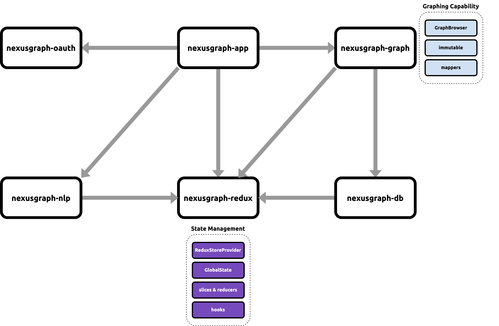

import Tabs from "@theme/Tabs";
import TabItem from "@theme/TabItem";

The following guide is intended for developers who want to make changes to the Nexus Graph. It will cover the design of
various subsystems.

Module Layout
-------------

Elide is a [mono-repo](https://qubitpi.github.io/monorepo.tools/) consisting of the following published modules:

| Module Name      | Description                                                       |
|------------------|-------------------------------------------------------------------|
| nexusgraph-app   | The user interface where user can use all features of Nexus Graph |
| nexusgraph-db    | Graph Data storage for nexusgraph CRUD API queries                |
| nexusgraph-graph | The core module that handles Graph rendering                      |
| nexusgraph-nlp   | The AI module that transforms text/audio into knowledge graphs    |
| nexusgraph-oauth | Handles Authentication                                            |
| nexusgraph-redux | The state management of the entire app                            |

High Level Design
-----------------

The following diagram represents a high level component breakout of Nexus Graph. Names in italics represent class names
whereas other names represent functional blocks (made up of many classes). Gray arrows represent client request and
response flow through the system.



Redux Module
------------

We are not using [Redux Toolkit](https://redux-toolkit.qubitpi.org/) because we want greater control over our
application states

We employ redux by defining a GlobalState and a bunch of slices, which include reduces, to manipulate these states.

The module also maintains the domain model of a "Graph" which includes 3 representations:

1. A [Node][Graph Node]
2. A [Link][Graph Link]
3. A [Graph][Graph]

Basically, all Nexus Graph components agree on such data structure to model a graph. If a different representation is
needed, such as in nexusgraph-graph module, where a node needs to encode its position on a graph canvas, a
[separate transformation](https://nexusgraph.qubitpi.org/api/functions/nexusgraph_graph_src_mappers.mapToBasicNodes.html)
would be needed

Please keep in mind that Nexus Graph uses intensively 2 of the Redux's recommended practices:

1. [Selector Functions][Redux Action Creators]
2. [Action Creators][Redux Selector Functions]

Graph Module
------------

Our graph model is deeply nested, which causes a
[huge pain on Redux state update](https://stackoverflow.com/questions/62373936/component-not-updating-on-deeply-nested-redux-object).
We take an
[immutable approach](https://redux.qubitpi.org/usage/structuring-reducers/immutable-update-patterns/#immutable-update-utility-libraries)
to address such issue.

Database Module
---------------

Nexus Graph is storage agnostic.

Semantic layer: `GraphClient`.

Our free version comes with an in-memory [json-graphql-server]. We can host our own on-premise production version with
[astraios.io], our official supported backend for storing graphs. Or we can implement our own [graph API](#graph-api)

### json-graphql-server

```bash
cd nexusgraph
yarn start:graph-api
```

The server will be running at `http://localhost:5000/`.

:::tip

There is a very useful debugging technique: if you click the axios request to the server from browser console, it will
take you directly to the `http://localhost:5000/` with the actual query printed on it, ready to be re-sent for debugging
purposes.

:::

### Graph API

The Graph API server should support the following Operations with specified GraphQL query and response schema:

#### Saving or Updating

##### Nodes

<Tabs>
  <TabItem value="graphql-query" label="GraphQL Query" default>
    ```graphql
    mutation {
        node(
          op:UPSERT
          data:[
            {fields: "{\"name\": \"My Node\"}", noteId:"1"},
            {fields: "{\"name\": \"My Node 2\"}", noteId:"2"}
          ]) {
            edges {
                node {
                    id
                }
            }
        }
    }
    ```
  </TabItem>
  <TabItem value="graphql-response" label="Response">
    ```json
    {
      "data": {
        "node": {
          "edges": [
            {
              "node": {
                "id": "15"
              }
            },
            {
              "node": {
                "id": "16"
              }
            }
          ]
        }
      }
    }
    ```
  </TabItem>
</Tabs>

#### Links

<Tabs>
  <TabItem value="graphql-query" label="GraphQL Query" default>
    ```graphql
    mutation {
        link(
            op:UPSERT
            data: [
              {
                sourceNode:{id:15},
                targetNode:{id:16},
                fields: "{\"type\": \"points to\"}"
              },
              {
                sourceNode:{id:13},
                targetNode:{id:14},
                fields: "{\"type\": \"points to\"}"
              }
            ]
        ) {
            edges {
                node {
                    id
                }
            }
        }
    }
    ```
  </TabItem>
  <TabItem value="graphql-response" label="Response">
    ```json
    {
      "data": {
        "link": {
          "edges": [
            {
              "node": {
                "id": "4"
              }
            },
            {
              "node": {
                "id": "5"
              }
            }
          ]
        }
      }
    }
    ```
  </TabItem>
</Tabs>

##### Graph

<Tabs>
  <TabItem value="graphql-query" label="GraphQL Query" default>
    ```graphql
    mutation {
        graph(
            op: UPSERT
            data:{
                userId: "10000",
                name: "My Graph",
                nodes: [{id:13},{id:14},{id:15},{id:16}],
                links: [{id:4},{id:5}]
            }
        ) {
          edges {
            node {
                id
                userId
                name
                nodes {
                    edges {
                        node {
                            ...nodeAttributes
                        }
                    }
                }
                links {
                    edges {
                        node {
                            id
                            sourceNode {
                                edges {
                                    node {
                                        ...nodeAttributes
                                    }
                                }
                            }
                            targetNode {
                                edges {
                                    node {
                                        ...nodeAttributes
                                    }
                                }
                            }
                            fields
                        }
                    }
                }
                dateCreated
                dateUpdated
            }
          }
        }
    }

    fragment nodeAttributes on Node {
      id
      noteId
      fields
    }
    ```

  </TabItem>
  <TabItem value="graphql-response" label="Response">
    The response format is the same as that of [Getting Graph By ID](#getting-graph-by-id)
  </TabItem>
</Tabs>

#### Getting Graph By ID

<Tabs>
  <TabItem value="graphql-query" label="GraphQL Query" default>
    ```graphql
    {
        graph(ids: ["5"]) {
            edges {
                node {
                    id
                    userId
                    name
                    nodes {
                        edges {
                            node {
                                ...nodeAttributes
                            }
                        }
                    }
                    links {
                        edges {
                            node {
                                id
                                sourceNode {
                                    edges {
                                        node {
                                            ...nodeAttributes
                                        }
                                    }
                                }
                                targetNode {
                                    edges {
                                        node {
                                            ...nodeAttributes
                                        }
                                    }
                                }
                                fields
                            }
                        }
                    }
                    dateCreated
                    dateUpdated
                }
            }
        }
    }

    fragment nodeAttributes on Node {
        id
        noteId
        fields
    }
    ```

  </TabItem>
  <TabItem value="graphql-response" label="Response">
    ```json
    {
      "data": {
        "graph": {
          "edges": [
            {
              "node": {
                "id": "5",
                "userId": "10000",
                "name": "My Graph",
                "nodes": {
                  "edges": [
                    {
                      "node": {
                        "id": "11",
                        "noteId": "1",
                        "fields": "{\"name\": \"My Node\"}"
                      }
                    },
                    {
                      "node": {
                        "id": "12",
                        "noteId": "1",
                        "fields": "{\"name\": \"My Node\"}"
                      }
                    }
                  ]
                },
                "links": {
                  "edges": [
                    {
                      "node": {
                        "id": "3",
                        "sourceNode": {
                          "edges": [
                            {
                              "node": {
                                "id": "11",
                                "noteId": "1",
                                "fields": "{\"name\": \"My Node\"}"
                              }
                            }
                          ]
                        },
                        "targetNode": {
                          "edges": [
                            {
                              "node": {
                                "id": "12",
                                "noteId": "1",
                                "fields": "{\"name\": \"My Node\"}"
                              }
                            }
                          ]
                        },
                        "fields": "{\"type\": \"points to\"}"
                      }
                    }
                  ]
                },
                "dateCreated": 1705382225651,
                "dateUpdated": 1705382225651
              }
            }
          ]
        }
      }
    }
    ```
  </TabItem>
</Tabs>

#### Deleting Graph By ID

##### Nodes

<Tabs>
  <TabItem value="graphql-query" label="GraphQL Query" default>
    ```graphql
    mutation {
      graph(op: DELETE, ids: ["5"]) {
        edges {
          node {
            id
            name
          }
        }
      }
    }
    ```

  </TabItem>
  <TabItem value="graphql-response" label="Response">
    ```json
    {
      "data": {
        "graph": {
          "edges": []
        }
      }
    }
    ```

  </TabItem>
</Tabs>

#### Getting Graph Metadata list by User ID

<Tabs>
  <TabItem value="graphql-query" label="GraphQL Query" default>
    ```graphql
    {
      graph {
          edges {
              node {
                id
                name
                dateCreated
                dateUpdated
              }
          }
      }
    }
    ```
  </TabItem>
  <TabItem value="graphql-response" label="Response">
    ```json
    {
      "data": {
        "graph": {
          "edges": [
            {
              "node": {
                "id": "1",
                "name": "My Graph",
                "dateCreated": 1705372839620,
                "dateUpdated": 1705372839620
              }
            }
          ]
        }
      }
    }
    ```
  </TabItem>
</Tabs>

[astraios.io]: https://astraios.io

[json-graphql-server]: https://github.com/QubitPi/json-graphql-server

[Graph]: https://nexusgraph.qubitpi.org/api/interfaces/nexusgraph_redux.Graph.html
[Graph Link]: https://nexusgraph.qubitpi.org/api/interfaces/nexusgraph_redux.Link.html
[Graph Node]: https://nexusgraph.qubitpi.org/api/interfaces/nexusgraph_redux.Node.html

[Redux Action Creators]: https://redux.qubitpi.org/style-guide/#use-action-creators
[Redux Selector Functions]: https://redux.qubitpi.org/usage/deriving-data-selectors/#basic-selector-concepts
