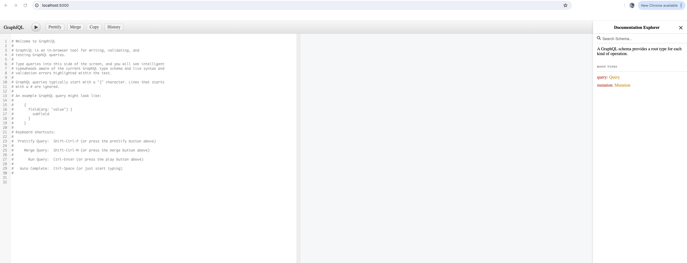
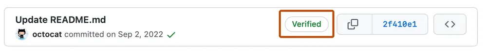

The following guide is intended to help developers who maintain or want to make changes to the Nexus Graph.

Prerequisites
-------------

- Node 18 (Install instruction can be found [here](https://deb.nodesource.com/))
- Yarn (`npm install --global yarn`)

:::tip[For Mac]

- __Xcode CLI tools__: We'll need to first install Xcode CLI tools. Run this command and follow the instructions

  ```shell
  xcode-select --install
  ```

- __Homebrew__: Install [Homebrew](http://brew.sh), and then run the following command to install
  [GPG](https://formulae.brew.sh/formula/gnupg) as we will [need it later](#signing-commits-with-gpg-key)

  ```shell
  brew install gnupg
  ```

:::

Getting the Source Codes
------------------------

To get started, clone the [repo](https://github.com/QubitPi/nexusgraph):

```bash
git clone git@github.com:QubitPi/nexusgraph.git
cd nexusgraph
```

We're going to be working out of this repository for the remainder of the setup.

Configuring Environment Variables
---------------------------------

:::tip[Shortcut]

Simply use the [.env.dev](https://github.com/QubitPi/nexusgraph/blob/master/.env.test):

```console
cp .env.test .env
```

We can now skip the rest of the section. In case one needs more details, however, the details below discusses each them

:::

Create a [`.env` file][`.env` file] which contains all runtime variables Nexus Graph needs. The following variables
needs to be defined:

- __NLP_API_URL__ The URL of [Theresa API](https://theresa-api.com) instance, Used turning Natural Language Texts
  into Knowledge Graphs
- __LOGTO_ENDPOINT_URL__

  - [Logto](https://docs.logto.io/) offers a comprehensive identity solution covering both the front and backend,
    complete with pre-built infrastructure and enterprise-grade solutions.
  - In the Nexus Graph we use Logto to verify that the user has logged in and automatically generate the user login page
  - __LOGTO_ENDPOINT_URL__ is the URL of your server that will receive the [webhook][Webhook] POST requests when the
    event occurs.

- __LOGTO_SIGN_IN_CALLBACK_URL__

  - [Redirect URI][Redirect URI] is an OAuth 2.0 concept which implies the location should redirect after authentication
  - __LOGTO_SIGN_IN_CALLBACK_URL__ is the redirect url after authentication

- __TEST_USER_EMAIL__

  - [Email][Username] is used for sign-in with username and password.
  - In Nexus Graph the __TEST_USER_EMAIL__ defines a user name dedicated to local login

- __TEST_USER_PASSWORD__

  - Password is used for sign-in with username and password.
  - In Nexus Graph the __TEST_USER_PASSWORD__ defines a password dedicated to local login

- __ASTRAIOS_GRAPHQL_API_ENDPOINT__

  - [Astraios][Astraios] is a JSR 370 web service template that lets us spin up model driven GraphQL or JSON API web
    service with minimal effort.
  - __ASTRAIOS_GRAPHQL_API_ENDPOINT__ Define the endpoint that sends GraphQL requests to Astraios

- __ASTRAIOS_JSON_API_ENDPOINT__ Define the endpoint that sends JSON requests to Astraios

Installing Dependencies
-----------------------

Nexus Graph uses [yarn workspace](https://classic.yarnpkg.com/lang/en/docs/workspaces/) to manage different components.
The command below shall install all the dependencies and put them in `node_modules`:

```bash
yarn
```

Once this command has finished we'll have Nexus Graph ready in development mode with all its required dependencies.

Running the Development Server
------------------------------

### Starting Dev AI Server

```console
yarn start:ai
```

NER data source is backed by [json-server] mock. They can be viewed by the following 3 links:

1. `http://localhost:3001/nodes`
2. `http://localhost:3001/links`
3. `http://localhost:3001`

### Starting Dev Backend Services

```console
yarn start:json-graphql-server-dev
```

Entering `http://localhost:5000/` will open up the GraphiQL for dev testing:



### Starting Nexus Graph

Now we can run the development server at `http://localhost:3000`:

```console
yarn start
```

Available Scripts
-----------------

After that, inside _nexusgraph_ directory, we can run several commands:

- `yarn start`: Runs the app in the development mode. Open `http://localhost:3000` to view it in
  the browser. The page will reload if you make edits. You will also see any lint errors in the console.
- `yarn test`: Runs all tests, including unit and integration tests
- `yarn build`: Builds the app for production to the `build` folder. It correctly bundles React in production mode and
  optimizes the build for the best performance. The build is minified and the filenames include the hashes.
- `yarn cypress:open`: Opens up the [Cypress End-to-End testing](https://docs.cypress.io/guides/overview/why-cypress) dashboard
- `yarn e2e`: Run end-to-end test

   - `yarn wait-on-dev`: Auxiliary command for e2e test which waits for production server
   `http://localhost:3000` to become available on CI/CD server

Happy building awesome knowledge graph app!

Writing TypeDoc
---------------

The [nexusgraph API][API] page was automatically generated by [TypeDoc][TypeDoc], which parses the inline documentation
of nexusgraph source code. To generated them locally

```bash
cd docs
yarn typedoc
```

We can have TypeDoc watch for changes from the command line by using

```bash
yarn typedoc-watch
```

Submitting Code
---------------

### Signing Commits with GPG Key

The purpose of GPG key is to sign the code for the authorship of our contributor.



This section teaches how to create a GPG key locally, upload it to GitHub, and use to sign future commits.

#### Create GPG Key Locally

In terminal, execute

```bash
gpg --full-generate-key
```

- key size must be __4096__ bits
- email must be the one associated with your GitHub account

To obtain the GPG key ID created just now:

```bash
gpg --list-secret-keys --keyid-format=long
```

An example output might be:

```bash
$ gpg --list-secret-keys --keyid-format=long
/Users/hubot/.gnupg/secring.gpg
------------------------------------
sec   4096R/3AA5C34371567BD2 2016-03-10 [expires: 2017-03-10]
uid                          Hubot <hubot@example.com>
ssb   4096R/4BB6D45482678BE3 2016-03-10
```

In the example above, the __GPG key ID is 3AA5C34371567BD2__; _we will be using this key ID in the following
discussion_

:::info

In case we would want to delete that key, we could do so by

```bash
gpg --delete-secret-keys 3AA5C34371567BD2
```

:::

#### Configuring git to Use GPG Key

We now instruct `git` to pick up the GPG key at every git commit:

```bash
git config --global user.signingkey 3AA5C34371567BD2
```

#### Uploading GPG Key to GitHub

Printout the GPG key in ASCII armor format:

```bash
gpg --armor --export 3AA5C34371567BD2
```

Copy the command output, i.e. the GPG key, including the __-----BEGIN PGP PUBLIC KEY BLOCK-----__, the
__-----END PGP PUBLIC KEY BLOCK-----__, as well as the contents in between.

Then following the [official documentation][GitHub - uploading GPG key] to upload the GPG key onto your GitHub account.

##### Signing Commits

:::info

If this is your first time submitting code using _git_, make sure to bind your GitHub username and account email first:

```bash
git config --global user.name "<username>"
git config --global user.email "<email>"
```

- Substitute `<username>` and `<email>` with your account info accordingly

:::

To commit with GPG-signed:

```bash
git commit -S -m "<commit message>"
```

where

- `-S` tells git to sign the commit with GPG key
- `<commit message>` should be adjusted accordingly

:::tip

If the commit command above errors with __gpg: signing failed: Inappropriate ioctl for device__ message,
[execute][GitHub - gpg signing erro]:

```bash
export GPG_TTY=$(tty)
```

then re-run the commit

:::

### Submitting

Before committing your code, please run the following checks locally in order to give ourselves better confidence that
the code will pass the automated checks online:

1. Prettier our code:

   ```bash
   npx prettier --write .
   ```

2. Check code style using ESLint:

   ```bash
   npx eslint .
   ```

   :::caution

   ESLint currently does not run on documentation source codes, i.e. `/docs`

   :::

3. Run all tests

   ```bash
   yarn test
   ```

CI/CD
-----

We use [GitHub Actions] for CI/CD, which contains 3 parts in the following order:

1. Code style check

   - [YAML & Markdown style checks](https://hashicorp-aws.com/blog/yml-and-md-style-checks)
   - [React & TypeScript code style checks by Prettier and ESLint](https://hashicorp-aws.com/blog/ui-code-style)

2. Tests

   - [Unit tests](https://hashicorp-aws.com/blog/ui-unit-test)
   - E2E tests via [Cypress](https://cypress.qubitpi.org)
   - [JSON schema](https://github.com/QubitPi/nexusgraph/blob/master/packages/nexusgraph-db/src/graph/default/DefaultGraphClient.ts#L28-L67)
     tests
   - Lighthouse test, an idea learned from
     [Docusaurus](https://github.com/facebook/docusaurus/blob/main/.github/workflows/lighthouse-report.yml)

3. [Release to NPM](https://hashicorp-aws.com/blog/npm-release)

Each part doesn't run until its previous dependency finishes successfully

### E2E Tests

The E2E tests spins up an [in-memory database](design#json-graphql-server) to store the test graphs.

Neo4J Arc Library
-----------------

### Load Neo4J Arc from Local

Nexus Graph's graphing capabilities is externalized to
[Neo4J's graphing library](https://github.com/QubitPi/neo4j-browser/tree/master/src/neo4j-arc). When we update the
library and would like to see its immediate effects, we could have Nexus Graph manually depend on the local version:

```bash
git clone https://github.com/QubitPi/neo4j-browser.git
cd neo4j-browser/src/neo4j-arc
yarn && yarn build
```

In nexusgraph, delete the `"neo4j-devtools-arc": "^x.y.z",` from `dependencies` section in
[`packages/nexusgraph-graph/package.json`](https://github.com/QubitPi/nexusgraph/blob/master/packages/nexusgraph-graph/package.json)
and run

```bash
yarn add /absolute/path/to/neo4j-browser/src/neo4j-arc/
yarn
yarn start
```

:::caution

When we are done, do not forget to put `"neo4j-devtools-arc": "^x.y.z"` back into `package.json`

:::

Troubleshooting
---------------

### React: Cannot assign to read only property `xxx` of object `#<Object>`

This was caused by immer's `produce` function which builds read-only deep copy of object. In Nexus Graph, all redux
states are make immutable using [immer], because, by experience, immutable states prevents bugs. As a result, all
in-memory state mutations should utilize our dedicated `immutable.ts` module. Failed to do that could result in the
error above because that indictes one is directly mutating our immutable states

### ESLint Reports False-Negative

Suppose we have the following TypeScript code

```typescript
node.radius + 25;
```

but ESLint complains that

```bash
error  Operands of '+' operation with any is possible only with string, number, bigint or any  @typescript-eslint/restrict-plus-operands
```

And we are sure that `node.radius` by definition is a `number`. This could happend due to the incorrect import, which
results `node` type not properly imported. As a result, TypeScript sees `node.radius` as to type `any` because it
doesn't know what type `node` is

### GitHub Actions Doesn't Start

If all syntax are correct, simply cancelled the job and re-run. It might be something on GitHub's end.

[API]: https://nexusgraph.qubitpi.org/api
[Astraios]: https://astraios.io/

[`.env` file]: https://create-react-app.dev/docs/adding-custom-environment-variables/

[GitHub Actions]: https://docs.github.com/en/actions
[GitHub - gpg signing erro]: https://github.com/keybase/keybase-issues/issues/2798#issue-205008630
[GitHub - uploading GPG key]: https://docs.github.com/en/authentication/managing-commit-signature-verification/adding-a-gpg-key-to-your-github-account

[immer]: https://immerjs.github.io/immer/

[json-server]: https://github.com/QubitPi/json-server

[Redirect URI]: https://www.oauth.com/oauth2-servers/redirect-uris/

[TypeDoc]: https://typedoc.org/guides/overview/

[Username]: https://docs.logto.io/docs/references/users/#username

[Webhook]: https://docs.logto.io/docs/recipes/webhooks/configure-webhooks-in-console/
