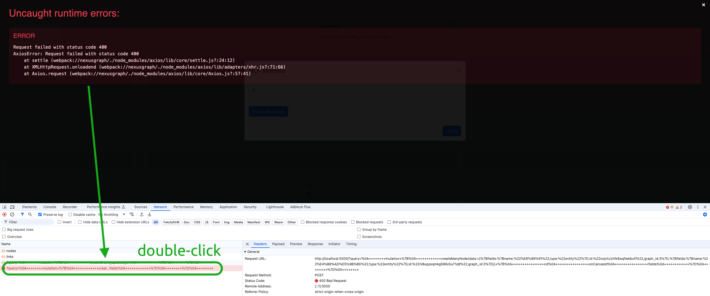
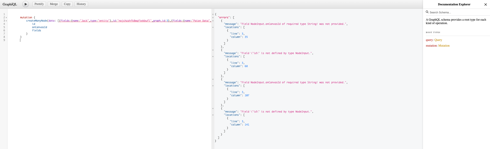

import Tabs from '@theme/Tabs';
import TabItem from '@theme/TabItem';

Graph API Development Server Guide
----------------------------------

### Example Queries

#### Get Graphs by ID

<Tabs>
  <TabItem value="query" label="Query" default>
    ```graphql
    {
       Graph(id: 1) {
          id
          name
          nodes: Nodes {
             id
             onCanvasId
             fields
          }
          links: Links {
             id
             onCanvasId
             source
             target
             fields
          }
       }
    }
    ```
  </TabItem>
  <TabItem value="response" label="Response">
    ```json
    {
        "data":{
            "Graph":{
                "id":"1",
                "name":"My Graph",
                "nodes":[
                    {
                        "id":"100",
                        "onCanvasId":"04308cf6-510c-4326-a6d6-2cae1850090d",
                        "fields":{
                            "name":"Nexus Graph"
                        }
                    },
                    {
                        "id":"101",
                        "onCanvasId":"2e8a1c17-1d86-4896-aa6f-945c113ca4d2",
                        "fields":{
                            "name":"People's lives"
                        }
                    }
                ],
                "links":[
                    {
                        "id":"1000",
                        "onCanvasId":"bf154640-0a86-42da-81ca-bbc21dad3e0c",
                        "source":"04308cf6-510c-4326-a6d6-2cae1850090d",
                        "target":"2e8a1c17-1d86-4896-aa6f-945c113ca4d2",
                        "fields":{
                            "type":"changes"
                        }
                    }
                ]
            }
        }
    }
    ```
  </TabItem>
</Tabs>

#### Creating A New Graph

Creating a graph in dev server is accomplished in 3 separate request in order. The cost of atomicity reduces the
complexity of the test API:

1. Creating a graph

   :::warning

   Unlike real database, the graph ID here starts with __0__. Be careful when using it in conditional. For example, it
   is not a good idea to do

   ```typescript
   return graph.id ? this.update(graph) : this.save(graph);
   ```
   
   Instead, do

   ```typescript
   return graph.id == undefined ? this.save(graph) : this.update(graph)
   ```

   ::::

   <Tabs>
     <TabItem value="request" label="Request" default>
       ```graphql
       mutation {
           createGraph(name: "My Graph", created_on:"2024-07-15", last_updated_on: "2024-07-15", user_id: 10000) {
               id
               name
               created_on
               last_updated_on
               user_id
           }
       }
       ```
     </TabItem>
     <TabItem value="response" label="Response">
       ```json
       {
           "data":{
               "createGraph":{
                   "id":"2",
                   "name":"My Graph",
                   "created_on":"2024-07-15T00:00:00.000Z",
                   "last_updated_on":"2024-07-15T00:00:00.000Z",
                   "user_id":"10000"
               }
           }
       }
       ```
     </TabItem>
   </Tabs>

2. Creating all nodes of the graph

   :::tip

   We can use [some tool](https://www.uuidgenerator.net/version4) that quickly generates the `onCanvasId` for us

   :::

   <Tabs>
     <TabItem value="request" label="Request" default>
       ```graphql
       mutation {
           createManyNode(data: [
               {
                   onCanvasId: "3acf79c6-8533-43d9-8ddf-f2f87619f779",
                   fields: "{\"name\": \"my source node\"}",
                   graph_id: 2,
               },
               {
                   onCanvasId: "b2e39487-854f-4416-a56c-ac1ff7484d92"
                   fields: "{\"name\": \"my target node\"}",
                   graph_id: 2
               }
           ]) {
               id
               onCanvasId
               fields
               graph_id
           }
       }
       ```
     </TabItem>
     <TabItem value="response" label="Response">
       ```json
       {
           "data":{
               "createManyNode":[
                   {
                       "id":"102",
                       "onCanvasId":"3acf79c6-8533-43d9-8ddf-f2f87619f779",
                       "fields":"{\"name\": \"my source node\"}",
                       "graph_id":"2"
                   },
                   {
                       "id":"103",
                       "onCanvasId":"b2e39487-854f-4416-a56c-ac1ff7484d92",
                       "fields":"{\"name\": \"my target node\"}",
                       "graph_id":"2"
                   }
               ]
           }
       }
       ```
     </TabItem>
   </Tabs>

3. Creating all links of the graph

   <Tabs>
     <TabItem value="request" label="Request" default>
       ```graphql
       mutation {
           createManyLink(data: [
               {
                   onCanvasId: "0a784293-e8a1-4e0d-b1dc-14a53194f1e8",
                   source: "3acf79c6-8533-43d9-8ddf-f2f87619f779",
                   target: "b2e39487-854f-4416-a56c-ac1ff7484d92",
                   fields: "{\"type\": \"my link\"}",
                   graph_id: 2,
               }
           ]) {
               id
               onCanvasId
               source
               target
               fields
           }
       }
       ```
     </TabItem>
     <TabItem value="response" label="Response">
       ```json
       {
           "data":{
               "createManyLink":[
                   {
                       "id":"1001",
                       "onCanvasId":"0a784293-e8a1-4e0d-b1dc-14a53194f1e8",
                       "source":"3acf79c6-8533-43d9-8ddf-f2f87619f779",
                       "target":"b2e39487-854f-4416-a56c-ac1ff7484d92",
                       "fields":"{\"type\": \"my link\"}"
                   }
               ]
           }
       }
       ```
     </TabItem>
   </Tabs>

#### Updating An Existing Graph

Updating graph metadata:

:::info

Test dev server is backed by json-graphql-server, which
[doesn't support nested query](https://github.com/marmelab/json-graphql-server/issues/45). Therefore we cannot update
nodes and links in one-shot.

:::

<Tabs>
  <TabItem value="request" label="Request" default>
    ```graphql
    mutation {
       updateGraph(
          id: 3,
          name: "My New Graph",
       ) {
          id
          name
          last_updated_on
       }
    }
    ```
  </TabItem>
  <TabItem value="response" label="Response">
    ```json
    {
        "data":{
            "updateGraph":{
                "id":"3",
                "name":"My New Graph"
            }
        }
    }
    ```
  </TabItem>
</Tabs>

Updating a single node:

<Tabs>
  <TabItem value="request" label="Request" default>
    ```graphql
    mutation {
       updateNode(
          id: 102,
          onCanvasId: "3acf79c6-8533-43d9-8ddf-f2f87619f779",
          fields: "{\"name\": \"my updated node\"}"
       ) {
          id
          onCanvasId
          fields
          graph_id
       }
    }
    ```
  </TabItem>
  <TabItem value="response" label="Response">
    ```json
    {
        "data":{
            "updateNode":{
                "id":"102",
                "onCanvasId":"3acf79c6-8533-43d9-8ddf-f2f87619f779",
                "fields":"{\"name\": \"my new node\"}",
                "graph_id":"2"
            }
        }
    }
    ```
  </TabItem>
</Tabs>

Creating a single node:

:::note

When we add a new node to an exiting graph, it's essentially updating the graph

:::

<Tabs>
  <TabItem value="request" label="Request" default>
    ```graphql
    mutation {
       createNode(
          onCanvasId: "4f6228fe-2b6f-49aa-b0a8-da3be27b8de8",
          fields: "{\"name\": \"my new node\"}",
          graph_id: 2
       ) {
          id
          onCanvasId
          fields
          graph_id
       }
    }
    ```
  </TabItem>
  <TabItem value="response" label="Response">
    ```json
    {
       "data":{
          "createNode":{
             "id":"10111",
             "onCanvasId":"4f6228fe-2b6f-49aa-b0a8-da3be27b8de8",
             "fields":"{\"name\": \"my new node\"}",
             "graph_id":"2"
          }
       }
    }
    ```
  </TabItem>
</Tabs>

Updating a single link:

<Tabs>
  <TabItem value="request" label="Request" default>
    ```graphql
    mutation {
       updateLink(
          id: 1001,
          onCanvasId: "0a784293-e8a1-4e0d-b1dc-14a53194f1e8",
          source: "3acf79c6-8533-43d9-8ddf-f2f87619f779",
          target: "b2e39487-854f-4416-a56c-ac1ff7484d92",
          fields: "{\"name\": \"my updated link\"}"
       ) {
          id
          onCanvasId
          source
          target
          fields
          graph_id
       }
    }
    ```
  </TabItem>
  <TabItem value="response" label="Response">
    ```json
    {
       "data": {
          "updateLink": {
             "id": "1001",
             "onCanvasId": "0a784293-e8a1-4e0d-b1dc-14a53194f1e8",
             "source": "3acf79c6-8533-43d9-8ddf-f2f87619f779",
             "target": "b2e39487-854f-4416-a56c-ac1ff7484d92",
             "fields": "{\"name\": \"my new link\"}",
             "graph_id": "2"
          }
       }
    }
    ```
  </TabItem>
</Tabs>

Creating a single link:

:::note

When we connect two existing nodes, it's essentially updating the graph

:::

<Tabs>
  <TabItem value="request" label="Request" default>
    ```graphql
    mutation {
       createLink(
          onCanvasId: "cb7ee059-8356-4bea-a203-a40c518a1863",
          source: "3acf79c6-8533-43d9-8ddf-f2f87619f779",
          target: "b2e39487-854f-4416-a56c-ac1ff7484d92",
          fields: {name: "my new link"},
          graph_id: 2
       ) {
          id
          onCanvasId
          source
          target
          fields
          graph_id
       }
    }
    ```
  </TabItem>
  <TabItem value="response" label="Response">
    ```json
    {
        "data":{
            "createLink":{
                "id":"10001",
                "onCanvasId":"cb7ee059-8356-4bea-a203-a40c518a1863",
                "source":"3acf79c6-8533-43d9-8ddf-f2f87619f779",
                "target":"b2e39487-854f-4416-a56c-ac1ff7484d92",
                "fields":{
                    "name":"my new link"
                },
                "graph_id":"2"
            }
        }
    }
    ```
  </TabItem>
</Tabs>


#### Get Graph by ID

```graphql
{
    allGraphs(filter: {id : 2}) {
        id
        user_id
        name
        Nodes {
            id
            graph_id
            fields
        }
        Links {
            id
            graph_id
            source
            target
            fields
        }
        created_on
        last_updated_on
    }
```

```json
{
    "data":{
        "allGraphs":[
            {
                "id":"2",
                "user_id":"10000",
                "name":"My Graph",
                "Nodes":[
                    {
                        "id":"102",
                        "graph_id":"2",
                        "fields":"{\"name\": \"my source node\"}"
                    },
                    {
                        "id":"103",
                        "graph_id":"2",
                        "fields":"{\"name\": \"my target node\"}"
                    }
                ],
                "Links":[
                    {
                        "id":"1001",
                        "graph_id":"2",
                        "source":102,
                        "target":103,
                        "fields":"{\"type\": \"my link\"}"
                    }
                ],
                "created_on":"2024-07-15T00:00:00.000Z",
                "last_updated_on":"2024-07-15T00:00:00.000Z"
            }
        ]
    }
}
```

### Troubleshooting

When we see an error that is thrown by the API server, we can open up the developer console and double-click the error
request printed in red:



It will open up a GraphiQL user interface in web browser and shows us the error details:


