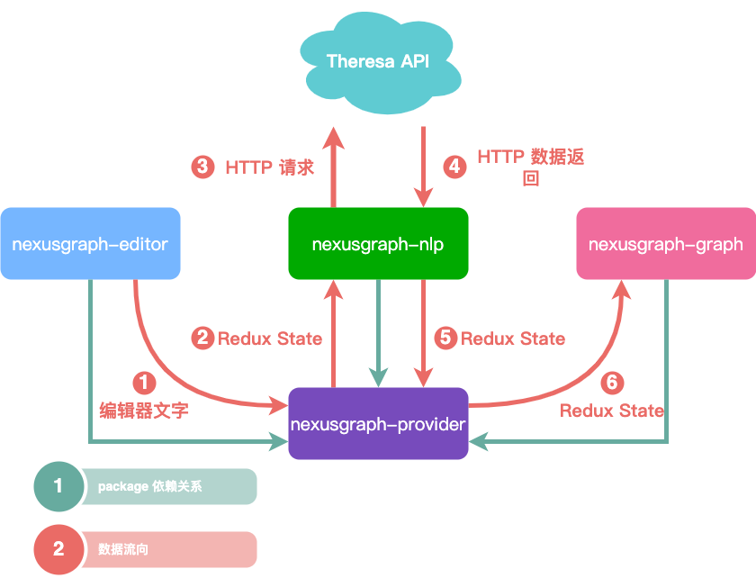
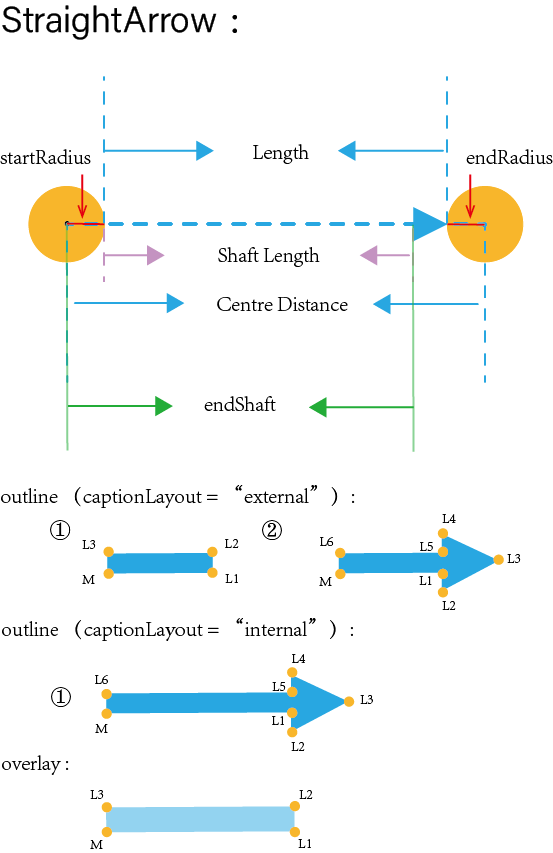
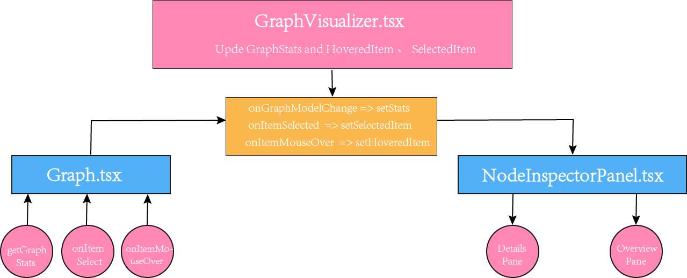

Nexus Graph 使用 [yarn workspace](https://classic.yarnpkg.com/lang/en/docs/workspaces/) 进行打包，除 `docs` 以外，其他的
Packages 都将依赖顶级目录下 `tsconfig.json` 进行配置

主要组件介绍
------------

Nexus Graph 的[UI 界面][UI 主界面]由两部分组成：

1. [文本编辑器](#编辑器)
2. [做图区域](#做图区域)

### 做图区域

#### GraphBrowser

**GraphBrowser** 是一个知识图谱可视化组件。Nexus Graph 的做图能力通过这个组件实现并连接至[主界面][UI 主界面]。

Nexus Graph 的设计遵循 [separation of concerns][separation of concerns] 原理 ；GraphBrowser 是唯一一个在其它 package
中可引入的做图组件，意味着，[nexus-graph] package 中的所有组件和代码都不能被 package 以外的组件引用，除了 GraphBrowser

#### 做图逻辑层

**Graph.tsx** 中包含了做图组件的整个实现逻辑。在这里我们通过 [D3][D3.js] 将数据可视化来实现做图，其封装在 **Visualization.ts** 类中。
通过创建 **Visualization.ts** 的实例来渲染整个 graph，**Graph.tsx** 不仅仅创建一张简单的静态图，还封装了 **事件处理程序** 以实现交互功
能。

#### Graph Model

做图组件展示的每一张知识图谱在底层都有一个对应的内存模型，我们把这个模型定义为 **Graph Model**，其主要由三个 TypeScript
类组成：

1. **Graph.ts** 定义了构建整个 graph 的逻辑，即图中节点和关系的添加、删除以及更新的逻辑，这意味着，我们每改变一次 graph 中的内容，都将调用
  Graph.ts 中的方法
2. **Node.ts** 定义了构建一个节点所需的所有参数
3. **Relationship.ts** 定义了构建一条关系所需的所有参数

#### Straight/Arc/Loop arrow 的原理

在 Nexus Graph 中，我们的 **Relationship** 有三种表现形式，分别是：**Straight**、**Arc**、**Loop**。这代表着节点间的不同情况：当两个
节点间存在一条关系时，**Relationship** 展现为 **Straight**，当两个节点间存在多条关系时，**Relationship** 展现为 **Arc**，当只有一个节
点并存在关系时，**Relationship** 展现为 **Loop**。其原理如下：

- 我们使用 **path** 标签来创建 **arrow**。通过计算得到 **arrow** 的一组点的坐标，利用坐标点来创建 [贝塞尔曲线][贝塞尔曲线] 以定义 path

- 以 **Straight Arrow** 为例，其各点的定义如图所示：
  > 

#### 统计面板

**NodeInspectorPanel** 定义了统计面板的渲染逻辑，统计面板分为 **OverviewPane** 和 **DetailsPane**
两类， OverviewPane 的作用是统计 graph 中所有节点和关系的类型以及数量。 DetailsPane 则是展示某一节点的属性详情。当用户鼠标选中某一节点时，
显示 DetailsPane，否则将默认显示 OverviewPane

- 统计面板的实现原理如下：

    - **NodeInspectorPanel** 首先利用 **Graph.tsx** 统计 graph 中节点和关系的数量及类型，并得到HoveredItem 和 SelectedItem 的值，
    再通过父组件 **GraphVisualizer.tsx** 中的 **useState** 方法更新它们的值，最后将值传给 NodeInspectorPanel 进行渲染
    - 逻辑结构图如下：

      > 

### 编辑器

- 编辑器将与做图组件联动，当用户在编辑器中输入文本时，**GraphBrowser** 将实时生成关系图谱，这里我们使用 [Lexical][Lexical] 这一框架去实现
  编辑器

### NLP

- **NLP** 是 [Natural Language Processing][Natural Language Processing] 的简写，该组件的作用是根据编辑器中输入的文本信息向后端的机
  器学习服务器发送请求，并获取相应的图数据，返回到 [Redux Store][Redux Store] 中，从而更新数据。

### 供应者

- 该 **Provider** 组件使 Reduxstore 可供任何需要访问 Redux 存储的嵌套组件使用。其中包含 [Store 的创建][createStore] 以及各个组件数据
  更新的逻辑

[UI 主界面]: https://github.com/QubitPi/nexusgraph/blob/master/packages/nexusgraph-app/src/App.tsx

[nexus-graph]: https://github.com/QubitPi/nexusgraph/tree/master/packages/nexusgraph-graph

[separation of concerns]: https://en.wikipedia.org/wiki/Separation_of_concerns

[贝塞尔曲线]: https://developer.mozilla.org/en-US/docs/Web/SVG/Tutorial/Paths#b%C3%A9zier_curves

[D3.js]: https://d3js.org/

[Lexical]: https://lexical.dev/

[Redux Store]: https://redux.js.org/api/store

[Natural Language Processing]: https://en.wikipedia.org/wiki/Natural_language_processing

[createStore]: https://redux.js.org/api/createstore
