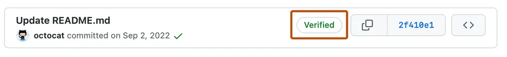

本指南将引导您在 macOS 和 Linux 上为 Nexus Graph 配置本地开发环境。如果您使用其他操作系统（Plan 9、BeOS、Windows，...），指令仍然大致相
同，但我们目前没有任何维护其他操作系统的官方文件。

开发
----

这部分将指导您手动设置开发环境。

### 克隆代码库

首先，克隆 [repo](https://github.com/QubitPi/nexusgraph) 或你的 fork。

```bash
git clone git@github.com:QubitPi/nexusgraph.git
cd nexusgraph
```

在接下来的安装过程中，我们将使用这个代码库。

### 系统依赖

让我们确保我们的系统可以支持 Nexus Graph 运行。

#### Xcode CLI 工具（Mac 专用）

我们需要首先安装 Xcode CLI 工具。运行此命令并按照说明进行操作：

```shell
xcode-select --install
```

#### Brew

安装 [Homebrew](http://brew.sh)，然后运行以下命令来安装
[GPG](https://formulae.brew.sh/formula/gnupg)，因为我们 [稍后会需要它](#signing-commits-with-gpg-key)。

```shell
brew install gnupg
```

### Node 16 & Yarn

安装 [node.js][node.js] 和 [Yarn][yarn install]:

```bash
npm install --global yarn
```

### 配置环境变量

创建一个包含 Nexus Graph 运行时需要的所有变量的 [`.env` 文件][`.env` file]。以下变量
需要定义:

- **THERESA_API_URL** 请求 [Theresa API](https://theresa-api.com) 的URL，用于将将自然语言文本转化为知识图谱
- **LOGTO_ENDPOINT_URL**
  - [Logto](https://docs.logto.io/) 提供了一个全面的身份验证的解决方案，包括前端和后端，以及预构建的基础配置和企业级解决方案。
  - 在 Nexus Graph 中，我们使用Logto来验证用户是否已登录并自动生成用户登录页面
  - **LOGTO_ENDPOINT_URL** 是当例如用户注册等事件发生时，接收 [Webhook][Webhook] POST 请求的服务器URL
- **LOGTO_SIGN_IN_CALLBACK_URL**
  - [重定向URL][重定向URL] 是一个OAuth 2.0的概念，这意味着该地址应该在身份验证后重定向到此次
  - **LOGTO_SIGN_IN_CALLBACK_URL** 身份验证后重定向的URL
- **TEST_USER_EMAIL**
  - [Username][Username] 用于使用用户名和密码登录。
  - 在 Nexus Graph 中，**TEST_USER_EMAIL** 定义了一个专用于本地登录的用户名
- **TEST_USER_PASSWORD**
  - Password 用于使用用户名和密码登录。
  - 在 Nexus Graph 中 **TEST_USER_PASSWORD** 定义了一个专用于本地登录的密码
- **ASTRAIOS_GRAPHQL_API_ENDPOINT**
  - [Astraios][Astraios] 是一个 JSR 370 web service 模板，它允许我们以最小的努力启动模型驱动的 GraphQL 或 JSON API web 以提供服务。
  - **ASTRAIOS_GRAPHQL_API_ENDPOINT** 定义向 Astraios 发送 GraphQL 请求的端点
- **ASTRAIOS_JSON_API_ENDPOINT** 定义向 Astraios 发送 JSON 请求的端点

#### 使用环境变量

[`.env.test` 文件][`.env.test` file] 中提供了一个 [`.env` 文件] 的例子：

```bash
THERESA_API_URL=http://localhost:5000/
LOGTO_ENDPOINT_URL=https://u4v5ne.logto.app/
LOGTO_SIGN_IN_CALLBACK_URL=http://localhost:8080/login
LOGTO_APP_ID=ypon89z8rtrjdg5ta669l
TEST_USER_EMAIL=test123
TEST_USER_PASSWORD=test123123
ASTRAIOS_GRAPHQL_API_ENDPOINT=http://localhost:8080/v1/data/
ASTRAIOS_JSON_API_ENDPOINT=http://localhost:8080/v1/data/
NODE_ENV=development
```

在本地复制 `.env.test` 文件的内容到 `.env` 文件即可完成配置。

### 启动 Docker Compose 以支持 Astraios 请求

你可以参考 [Astraios 文档][Astraios Development] 来学习如何在 [Docker Compose](https://docs.docker.com/compose/)
中运行 Webservice

Bootstrap
---------

Nexus Graph 使用 [yarn workspace](https://classic.yarnpkg.com/lang/en/docs/workspaces/) 来管理不同的组件。
下面的命令将安装所有依赖项并将它们放入 `node_modules`:

```bash
yarn
```

该命令完成后，我们将在开发模式下准备好 Nexus Graph 及其所有必需的依赖项。

运行 Development Server
------------------------------

现在我们可以在 `http://localhost:3000` 端口运行 Development Server:

```bash
yarn start
```

### 可用的命令

之后，在nexusgraph目录中，我们可以运行以下命令：

- `yarn start`: 以开发模式运行 App。在浏览器中打开 `http://localhost:3000` 即可查看运行结果。如果您对 App 进行编辑，页面将会重新加载。
  并且您将在控制台中看到任何 lint 错误。
- `yarn test`: 运行所有测试，包括单元测试和集成测试
- `yarn build`: 该指令用于将 App 构建到 build 文件夹中。使它在生产模式下能够正确捆绑 React 并优化构建以获得最佳性能。build 已压缩，文件
  名包含哈希值。
- `yarn cypress:open`: 打开 [Cypress End-to-End testing](https://docs.cypress.io/guides/overview/why-cypress) 仪表板
- `yarn e2e`: 运行 end-to-end 测试

   - `yarn wait-on-dev`: e2e 测试的辅助命令，用于等待 **Production Server** `http://localhost:3000` 在 CI/CD 服务器上变得可用

快乐构建精彩的知识图谱 App 吧！

编写 TypeDoc
------------

nexusgraph [API 页面][API] 由 [TypeDoc][TypeDoc] 自动生成，它将解析 nexusgraph 源代码的内联文档，在本地生成它们。

```bash
cd docs
yarn typedoc
```

我们可以让 TypeDoc 通过该命令监视行内的更改

```bash
yarn typedoc-watch
```

提交代码
-------

### 使用 GPG Key 提交签名

使用 GPG Key 的目的是让我们贡献者以作者身份对代码进行签名。



本节将介绍如何在本地创建 GPG 密钥，将其上传到 GitHub，并用于签署未来的提交。

#### 创建本地 GPG Key

在终端中，执行以下指令

```bash
gpg --full-generate-key
```

- 密钥大小必须为 **4096** 位
- 电子邮箱必须是与您 GitHub 帐户关联的电子邮箱

获取刚才创建的GPG密钥ID：

```bash
gpg --list-secret-keys --keyid-format=long
```

示例输出：

```bash
$ gpg --list-secret-keys --keyid-format=long
/Users/hubot/.gnupg/secring.gpg
------------------------------------
sec   4096R/3AA5C34371567BD2 2016-03-10 [expires: 2017-03-10]
uid                          Hubot <hubot@example.com>
ssb   4096R/4BB6D45482678BE3 2016-03-10
```

在上面的示例中 **GPG key ID 是 3AA5C34371567BD2**; _我们将在下面的讨论中使用这个密钥_

:::info

如果我们想删除该 GPG key，我们可以通过以下指令

```bash
gpg --delete-secret-keys 3AA5C34371567BD2
```

:::

#### 配置 git 以使用 GPG Key

现在我们指示 git 在每次 git 提交时获取 GPG Key:

```bash
git config --global user.signingkey 3AA5C34371567BD2
```

#### Uploading GPG Key to GitHub

以 ASCII Armor 的格式打印 GPG Key:

```bash
gpg --armor --export 3AA5C34371567BD2
```

复制命令并输出，即为 GPG key, 包括 **-----BEGIN PGP PUBLIC KEY BLOCK-----**、
**-----END PGP PUBLIC KEY BLOCK-----** 以及中间的内容。

然后按照 [官方文档][GitHub - uploading GPG key] 将 GPG 密钥上传到您的 GitHub 帐户。

##### 签署提交

:::info

如果这是您第一次使用git提交代码，请确保先绑定您的 GitHub 用户名和帐户电子邮箱：

```bash
git config --global user.name "<username>"
git config --global user.email "<email>"
```

- 相应地替换 `<username>` 和 `<email>` 为您的帐户信息

:::

使用 GPG-signed 进行提交：

```bash
git commit -S -m "<commit message>"
```

- `-S` 告诉 git 使用 GPG Key 签署提交
- `<commit message>` 应作相应调整

:::tip

如果上面的提交命令出现 **gpg: signing failed: Inappropriate ioctl for device** 的信息,
[请执行][GitHub - gpg signing erro]：

```bash
export GPG_TTY=$(tty)
```

然后重新运行提交

:::

### 提交

在提交代码之前，请在本地运行以下检查，以便我们能够确保代码可以通过在线自动检查：

1. 规范我们的代码:

   ```bash
   npx prettier --write .
   ```

2. 使用 ESLint 检查代码样式:

   ```bash
   npx eslint .
   ```

   :::caution

   ESLint 目前不能在文档源代码上运行，即 `/docs`

   :::

3. 运行所有测试

   ```bash
   yarn test
   ```

故障排除
-------

### Docusaurus 相对链接被 CI Markdown 链接检查处理为 False-Negative

Markdown 链接 (`markdown-link-check`) 的 CI 检查已打开，但它不够智能，无法检测 Docusaurus 的相对链接。解决方法是禁用相关行的链接检查。
例如：

```markdown
<!-- markdown-link-check-disable -->
known. Additionally, this process makes it easy to implement a [blue-green deployment](continuous-delivery) or
<!-- markdown-link-check-enable -->
```

### ESLint 报告 False-Negative

假设我们有以下 TypeScript 代码

```typescript
node.radius + 25;
```

但 ESLint 报以下错误

```bash
error  Operands of '+' operation with any is possible only with string, number, bigint or any  @typescript-eslint/restrict-plus-operands
```

根据 `node.radius` 的定义，我们确信它是一个 `number`. 发生这种情况的原因可能是导入不正确，导致 `node` 的类型未正确导入。TypeScript 将其
`node.radius` 的类型视为 `any`，因为它不知道 `node` 的类型是什么

[API]: https://nexusgraph.qubitpi.org/api
[Astraios]: https://astraios.io/

[`.env` file]: https://create-react-app.dev/docs/adding-custom-environment-variables/
[`.env.test` file]: https://github.com/QubitPi/nexusgraph/blob/master/.env.test

[GitHub - gpg signing erro]: https://github.com/keybase/keybase-issues/issues/2798#issue-205008630
[GitHub - uploading GPG key]: https://docs.github.com/en/authentication/managing-commit-signature-verification/adding-a-gpg-key-to-your-github-account

[node.js]: https://nodejs.org/en

[onchange]: https://www.npmjs.com/package/onchange

[Redirect URI]: https://www.oauth.com/oauth2-servers/redirect-uris/

[TypeDoc]: https://typedoc.org/guides/overview/

[Username]: https://docs.logto.io/docs/references/users/#username

[Webhook]: https://docs.logto.io/docs/recipes/webhooks/configure-webhooks-in-console/

[yarn install]: https://classic.yarnpkg.com/lang/en/docs/install/#mac-stable
